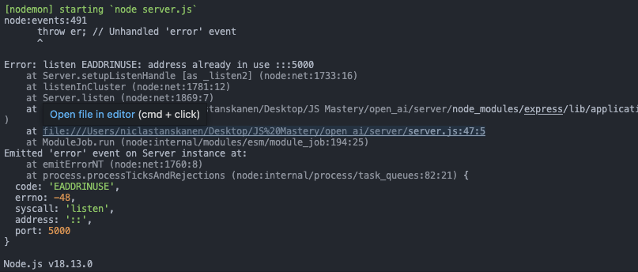
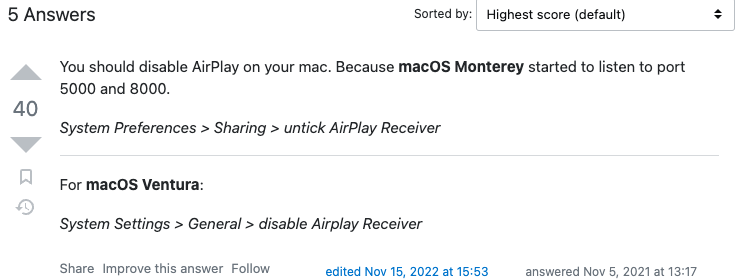
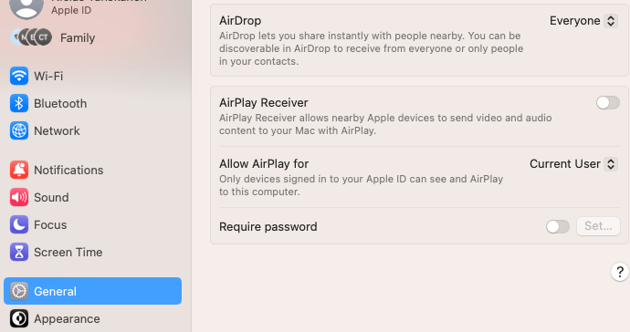

# Open Ai

## Table of Contents

- [User Experience (UX)](#user-experience-ux)
  - [Design](#design)
    - [Color Scheme](#color-scheme)
    - [Typography](#typography)
- [Features](#features)
  - [Home Page](#home-page)
- [Testing](#testing)
  - [Bugs](#bugs)
    - [Fixed Bugs](#fixed-bugs)
    - [Remaining Bugs](#remaining-bugs)
- [Technologies Used](#technologies-used)
  - [Languages and Frameworks Used](#languages-and-frameworks-used)
  - [Node Packages / Dependencies Used](#node-packages--dependencies-used)
  - [Programs and Tools Used](#programs-and-tools-used)
- [Deployment](#deployment)
  - [Forking the GitHub Repository](#forking-the-github-repository)
  - [Making a Local Clone](#making-a-local-clone)
- [Credits](#credits)
  - [Acknowledgments](#acknowledgments)


## User Experience UX


### Color-scheme


### Typography


<hr>

## Features


### Home Page

<hr>

## Testing

### Bugs
### Fixed Bugs






### Remaining Bugs


<hr>

## Technologies Used

### Languages and Frameworks Used


### Node Packages / Dependencies Used


### Programs and Tools Used


<hr>

## Deployment

### Forking the GitHub Repository

By forking the GitHub Repository we make a copy of the original repository on
our GitHub account to view and/or make changes without affecting the original
repository by using the following steps...

1. Log in to GitHub and locate the [GitHub
   Repository](https://github.com/niclastanskanen/open-ai)
1. At the top of the Repository (not top of page) just above the "Settings"
   Button on the menu, locate the "Fork" Button.
1. Click the button (not the number to the right) and you should now have a copy
   of the original repository in your GitHub account.

### Making a Local Clone

**NOTE**: It is a requirement of the project that you have Python version 3.8 or higher installed locally.

1. Log in to GitHub and locate the [GitHub Repository](https://github.com/niclastanskanen/open-ai).
1. Under the repository name, click "Code".
1. To clone the repository using HTTPS, under "HTTPS", copy the link.
1. Open your local terminal with git installed
1. Change the current working directory to the location where you want the cloned directory to be created.
1. Type `git clone`, and then paste the URL you copied in Step 3.

    ```console
    ~$ git clone https://github.com/niclastanskanen/open-ai
    ```

1. Press Enter. Your local clone will be created.

    ```console
    $ git clone https://github.com/niclastanskanen/open-ai
    > Cloning into `test-dir`...
    > remote: Counting objects: 10, done.
    > remote: Compressing objects: 100% (8/8), done.
    > remove: Total 10 (delta 1), reused 10 (delta 1)
    > Unpacking objects: 100% (10/10), done.
    ```

    [Click here](https://help.github.com/en/github/creating-cloning-and-archiving-repositories/cloning-a-repository#cloning-a-repository-to-github-desktop) for a more detailed explanation of the process above with pictures.

1. Change the current working directory to the cloned project folder (this will be a child directory in the location you cloned the project).

1. This guide assumes you have Node.js and npm installed locally, if this is not the case please install these now.
1. From the terminal run the command `npm install` to install all project dependencies.
1. Run the command `npm start` to run the application.

### Deploying with Netlify

<hr>

## Credits


### Acknowledgments

Adrian for great support and mentor.

